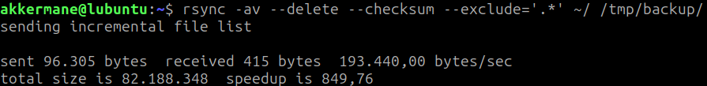
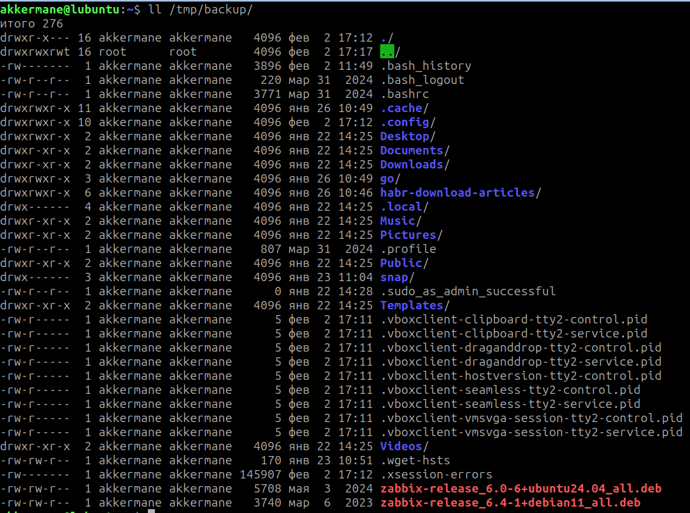
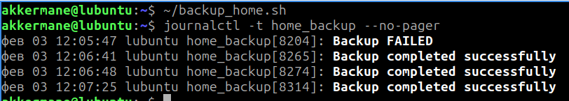

# Задание 

## Задание 1

    Составьте команду rsync, которая позволяет создавать зеркальную копию домашней директории пользователя в директорию /tmp/backup
    Необходимо исключить из синхронизации все директории, начинающиеся с точки (скрытые)
    Необходимо сделать так, чтобы rsync подсчитывал хэш-суммы для всех файлов, даже если их время модификации и размер идентичны в источнике и приемнике.
    На проверку направить скриншот с командой и результатом ее выполнения

## Задание 2

    Написать скрипт и настроить задачу на регулярное резервное копирование домашней директории пользователя с помощью rsync и cron.
    Резервная копия должна быть полностью зеркальной
    Резервная копия должна создаваться раз в день, в системном логе должна появляться запись об успешном или неуспешном выполнении операции
    Резервная копия размещается локально, в директории /tmp/backup
    На проверку направить файл crontab и скриншот с результатом работы утилиты.

    
# Решение 

## Задание 1

Скриншот команды запуска rsync и ее выполнения 



Результат выполнения копирования



## Задание 2

Скрипт для синхронизации

```
#!/bin/bash

SRC="/home/$USER/"
DST="/tmp/backup/"
LOG_TAG="home_backup"

rsync -a --delete --checksum --exclude='*/.*' "$SRC" "$DST"

if [ $? -eq 0 ]; then
    logger -t "$LOG_TAG" "Backup completed successfully"
else
    logger -t "$LOG_TAG" "Backup FAILED"
fi

```

Запись в системном журнале, что бэкап успешно выполнене



И задача в crontab


